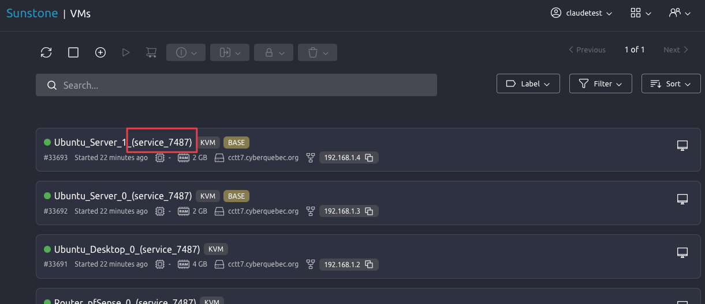
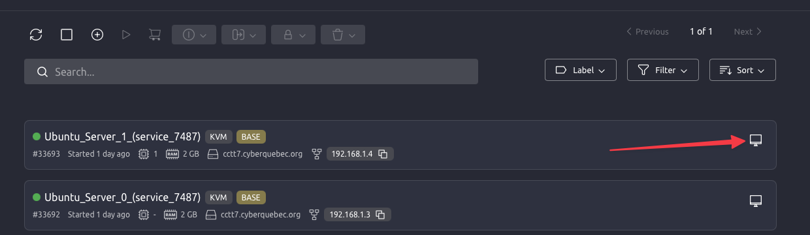
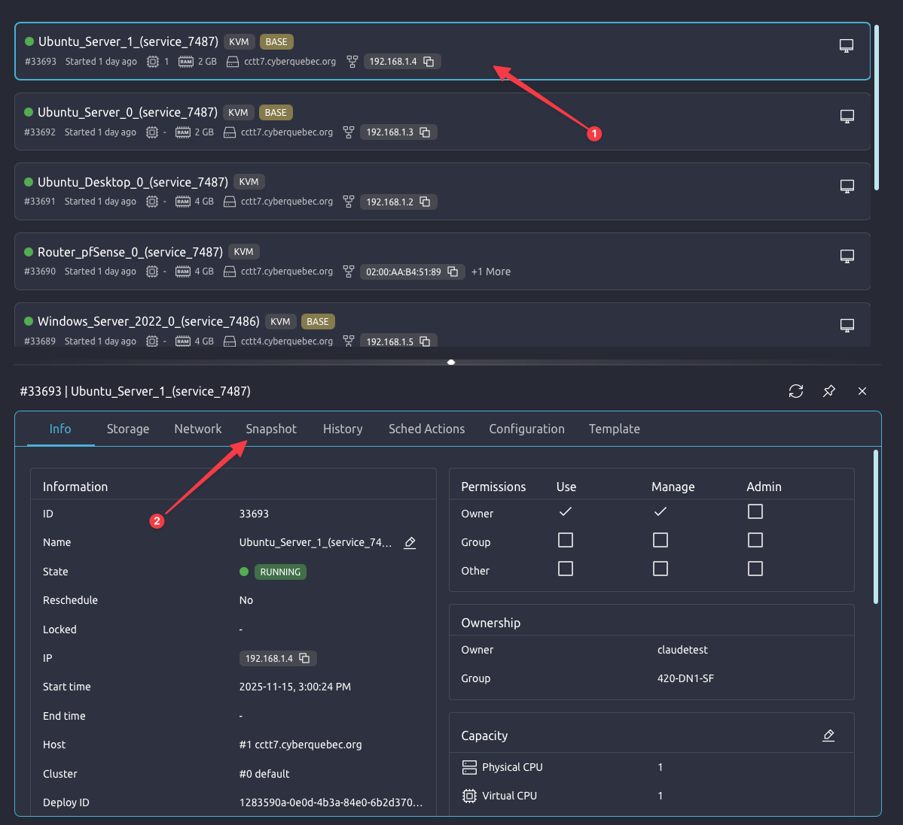
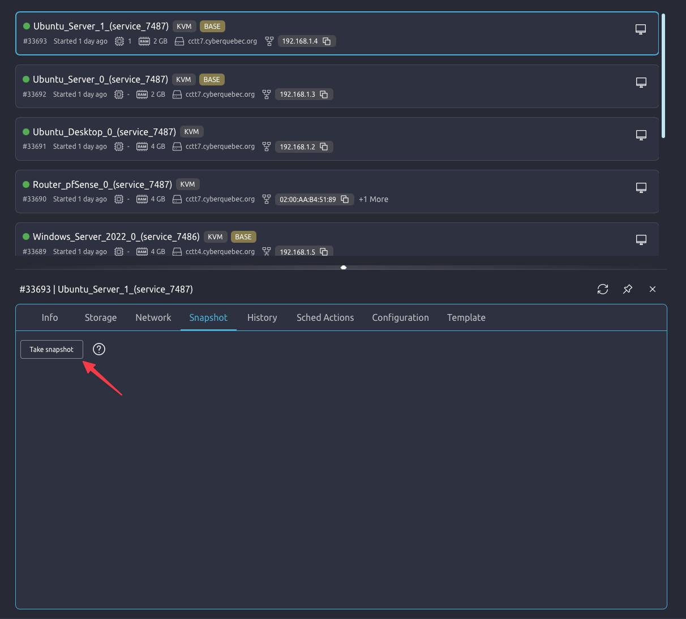
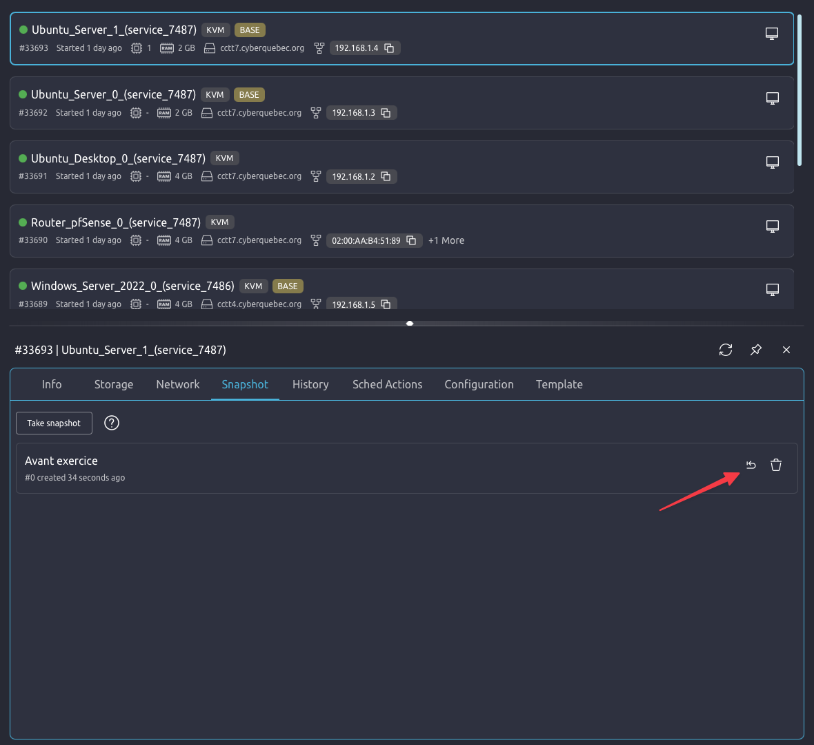
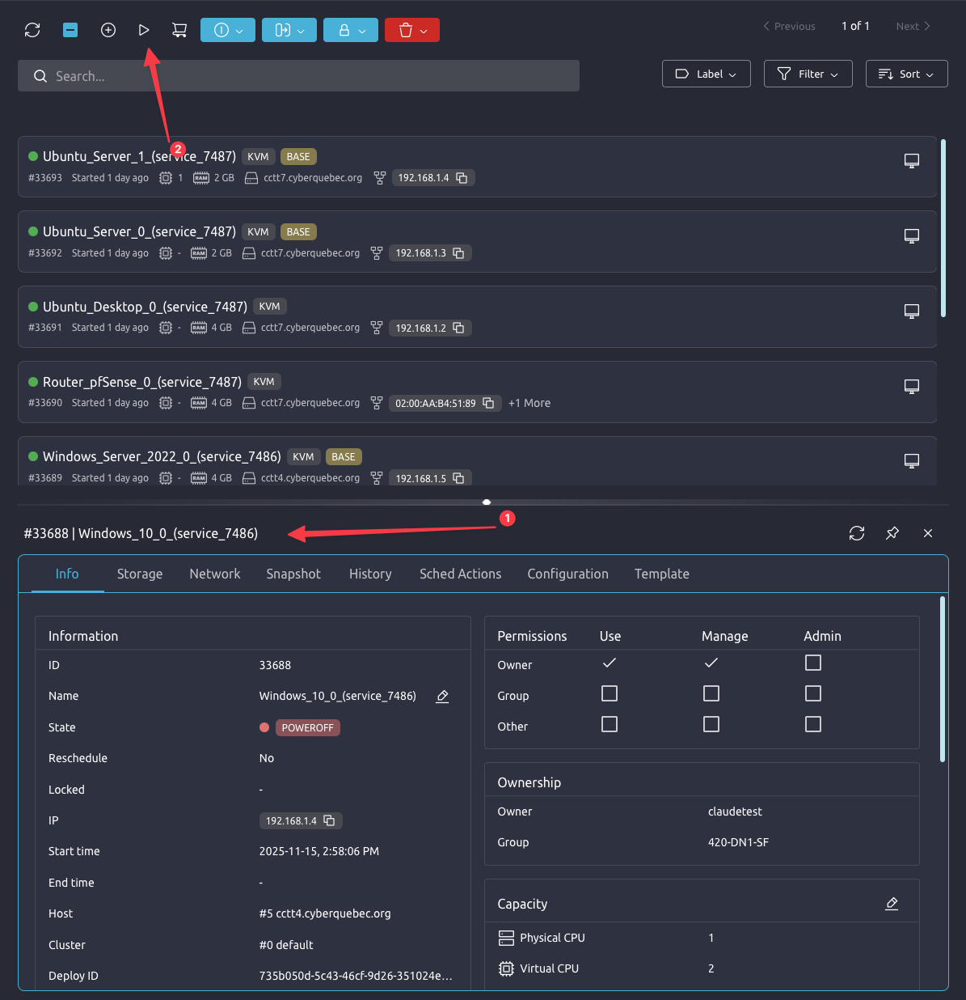

# Utilisation des images CyberQuébec

Voici les informations pour l'utilisation de l'environnement de CyberQuébec.

## Connexion au VPN
Pour vous connecter au VPN, naviguez à l'adresse [https://authentik.cyberquebec.org](https://authentik.cyberquebec.org) et entrez vos informations.

## Connexion au CyberRange
Une fois connectée au VPN, cliquez sur **OpenNebula FireEdge** (Sunstone est l'ancienne interface et elle sera éventuellement retirée) et utilisez les mêmes identifiants pour rejoindre le CyberRange.

## Connexion aux machines virtuelles avec OpenNebula  

Une fois connectée, vous arrivez à votre tableau de bord. Pour accéder à vos VMs, cliquez sur **VMs**.

  
**Image 1 : accès aux VMs.**

Les VMs sont associées à des services. Toutes les VMs qui ont le même numéro de service se retrouvent regroupées dans le même réseau.  

  
**Image 2 : numéro de service des VMs.**

Pour accéder à une VM, cliquez sur l'icône à droite de la VM.  

  
**Image 3 : accès à une VM.**

Les identifiants des machines virtuelles sont :  
- Nom d'utilisateur: env-admin  
- Mot de passe: admin-env

Les VMs ont des adresses dynamiques. Vous pouvez renouveler une adresse dans le réseau avec la commande suivante ou passer par Network Manager :

```bash
sudo dhclient -v ens3
```  

Cette commande fonctionne pour toute VM Linux, vous devez remplacer le nom de l'interface par celui de votre Linux. Pour trouver le nom de l'interface :

```bash
ip link
```  

### Instantanés (snapshot)  

Pour créer un instantané, cliquer sur la vm puis cliquer sur **Snapshot**. 
  
**Image 4 : accès aux instantanés.**

Finalement, cliquer sur **Take snapshot**.  

  
**Image 5 : prendre un instantané.**

Pour revenir à un instantané, cliquer sur **Revert**.  
  
**Image 5 : revenir à un instantané.**  

Si une VM est fermée (poweroff) pour la relancer (poweron), vous devez cliquer sur la VM, puis cliquer sur **Resume**.  

  
**Image 6 : lancer une VM.**  
