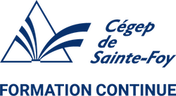

  

# 420-DN3-SF  

| Sécurisation d'un parc informatique - AEC (LEADN)    |
| :---                                                  |
| Les menaces informatiques                            |
| Hiver 2026 - Bloc 3 - UBR 4156                     |

## CALENDRIER

Ce calendrier est donné à titre indicatif et peut être modifié en fonction des circonstances. Dans le cas des examens, les étudiants seront toujours avisés dans un délai raisonnable.  

| Cours | Date | Contenu | Exercices/TP | Évaluations sommatives[^1] |
| :---: |  :---: | :--- | :--- | :--- |
| 1 | 14 avr. | Introduction  Présentation du plan de cours  CyberOps associate - module 13 Les attaquants et leurs outils | Exercice 1 - Préparer un environnement de travail |  |  
| 2 | 16 avr. | CyberOps - module 23 Évaluation des vulnérabilités des terminaux | | |
| 3 | 21 avr. | Introduction à Try Hack Me  THM - Tutorial  THM - OpenVPN  THM - Salle Mitre ATT&CK | | |
| 4 | 23 avr. | CyberOps Module 14 Les menaces et les attaques communes  Le segment, le paquet, la trame : révision sur le réseau. | Exercice 2 - Analyseurs de protocoles | |
| 5 | 25 avr.  samedi | Les outils de connexion : Ncat, socat, powershell | Exercice 3 - Introduction à ncat, socat et Powershell ||
| 6 | 25 avr.  samedi | Les outils de découverte du réseau : ping, nping, nmap | Exercice 4 - Découvrir nping et nmap |
| 7 | 28 avr. | | Exercice 5 - Découvrir scapy |  **Évaluation - Menaces, attaques, vulnérabilités.**  **20 %** |
| 8 | 30 avr. | Les outils de découverte des vulnérabilités : Nessus, OpenVAS, nmap scripts | Exercice 6 - Nessus et scripts nmap ||
| 9 | 5 mai | Les mots de passe | Exercice 7 - Découvrir Metasploit ||
| 10 | 7 mai | | Exercice 8 - Extraction des mots de passe ||
| 11 | 12 mai | | **TP - Trouver les mots de passe** ||
| 12 | 14 mai | THM - Burp Suite : Basic, Repeater, Intruder | **Début des salles THM** ||
| 13 | 19 mai | THM - Introduction to OWASP ZAP  THM - Walking An Application |||
| 14 | 21 mai | THM - SQL Injection  THM - File Inclusion | | **Fin des exercices à remettre.**  **10 %** |
| 15 | 26 mai | THM - Authentication Bypass  THM - Cross-site Scripting | | **TP - Trouver les mots de passe.**  **20 %** |
| 16 | 28 mai | THM - SSRF  THM - IDOR  THM - Command Injection | ||
| 17 | 30 mai samedi | THM - Subdomain Enumeration THM - Active Directory Basics THM - Breaching Active Directory | ||
| 18 | 30 mai samedi | THM - Introduction to Antivirus | ||
| 19 | 2 juin | THM - AV Evasion: Shellcode | ||
| 20 | 4 juin | **Évaluation finale à caractère synthèse** | | **Fin des salles THM.** **20 %** **EFCS 30 %** |

[^1]: Cette colonne représente les dates de remise pour les exercices et les travaux. Pour les évaluations, elle représenta la date de l'évaluation. Pour l'EFCS, elle représente la date limite pour la remise et/ou la présentation.  

## Récapitulatif de la pondération des évaluations sommatives  

| **Évaluation** | **Pondération (%)** |
| :---          | :---: |
| Exercices à remettre (ER) | 10 |
| Évaluation - Menaces, attaques, vulnérabilités | 20 |
| Travail pratique - Trouver les mots de passe | 20 |
| Salles Try Hack Me | 20                           |
| Évaluation finale à caractère synthèse | 30 |

## RESSOURCES

**Livres obligatoires** :

- Aucun

**Web :**

- Site Web de l'académie Cisco : <https://www.netacad.com>.

- Site Web de Try Hack Me, inscription obligatoire d'un minimum de 2 mois (doit pouvoir couvrir le cours complet jusqu'au 4 juin) à \$14US/mois : <https://tryhackme.com/> (attendre la présentation du plan de cours avant de vous inscrire).

- CyberQuébec (optionnel) : <https://vpn.cyberquebec.org>
    - Pour l'information sur l'utilisation de CyberQuébec, consulter le document suivant : [CyberQC.md](./CyberQC.md).
